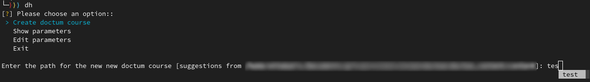
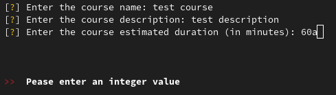
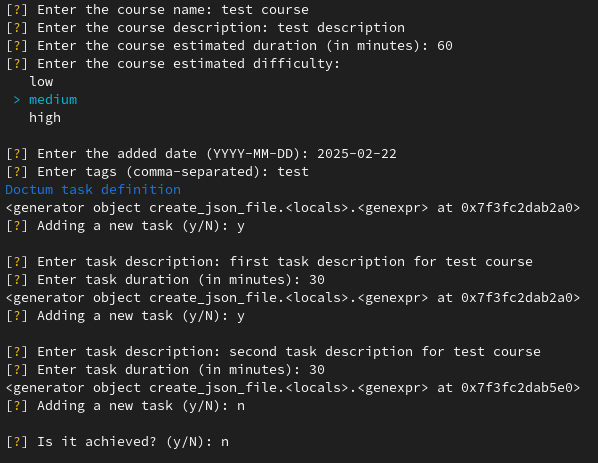

# doctum_helper

## Description

A simple linux terminal application that help writing [doctum content (courses)](https://github.com/Draed/doctum_content) with correct json format.

- Based on :
  - Bash (5.2.15(1)-release) : for installation script
  - Python (3.12.7) : for the application
  - pipx (1.7.1) : for application dependecies
  - git (2.47.0) : for git interaction with doctum_content repository
  - [Python package](./src/requirements.txt)

### Images





## Usage

### First installation 

> Note : Install script will ask for root passowrd as it try to install apt packages [see this steps in install.sh](./install.sh)

- Launch install script :
```shell
git clone https://github.com/Draed/doctum_helper.git
cd doctum_helper
bash install.sh
```

- Now the doctum_helper alias `dh` might be available, see [below doctum_helper usage](#doctum_helper-usage)

### doctum_helper (dh) usage

#### Launch doctum_helper 

- To start the program, just launch `dh` in the terminal and follow the instructions

#### First start (parameters configuration)

- At first start the doctum_helper will ask for default parameters :
  - the path to the doctum_content directory (where doctum_content should be stored)
  - the path to doctum repository (where to execute git command)
  - the default git remote name (default to 'origin')
  - the default git branch name (default to 'main')
  - the default git user name (default to 'doctum_helper')
  - the default git user email (default to 'doctum_helper@mail.local')
  - the activation parameter for git feature (if commit and push at any new course added or not)
  - the default course duration (in minutes)
  - the default course complexity (high, medium, low)
  - Some default task description to be used as completion (read article, see videos about, ...)

#### Completion

- When completion is available, it is advised in the question by "(use tab for completion)".
- Completion is available for 3 questions (use tab to trigger completion) :
  - Enter the path for the new new doctum course : listing existing path in doctum_content folder 
  - Enter the tag : showing doctum_content dir name as tag category
  - Enter the task description : with default task description
